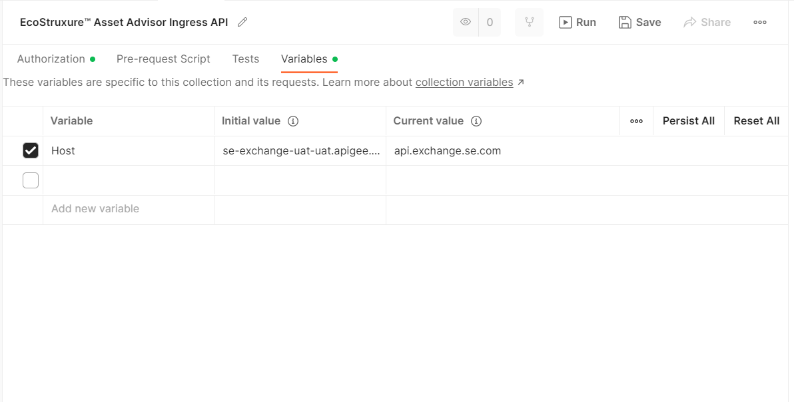
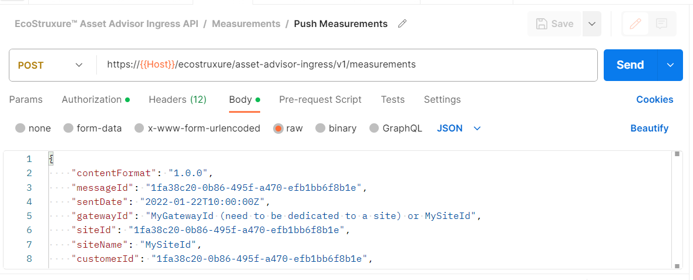

# Postman Collection

# About

This collection allows developers to test APIs through [Postman](https://www.postman.com/) application.

# Pre-requisites

* Postman desktop or web application
* Valid subscription to EcoStruxure™ Asset Advisor Ingress API product

## Usage
 
* [Import collection](#import-collection)
* [Configure variables](#configure-variables)
* [Execute](#execute-api)

## Import Collection

Import ```EcoStruxure™ Asset Advisor Ingress API.postman_collection.json``` to postman. Refer to [postman documentation to import a collection](https://learning.postman.com/docs/getting-started/importing-and-exporting-data/#importing-data-into-postman).

## Configure Variables

Edit the collection to configure the variables

* Configure Access Token

Configure the Personal Access Token created in Developer Portal after subscription


* Configure Host 



## Execute API
### **Push Measurements data in Asset Advisor**
- Trigger the request with request body to push timeseries measurement values in Asset Advisor.


